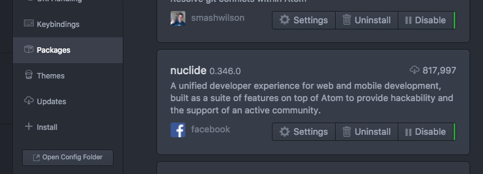
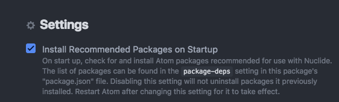

# React-Native Tutorial Prerequisites

You need to be able to run a default app in order to follow along with the course.

As react-native is Facebook's own open-source development platform, we will use
their own development tools.

For this reason, we will install the tools used by Facebook.  

## Operating Systems
OSX is the best platform for developing RN apps, as it supports iOS and Android, and also has the most support from facebook.  
Linux is the second best platform for developing RN apps, but obviously only supports Android and has worse performance as it is missing the hooks used by OSX to notify the IDE of file changes.
Windows is supported, but only for Android apps, and is definitely the worst experience, as the build step is slow, path lengths are limited, among other issues.
(If you are on OSX, you may use [homebrew](https://brew.sh/) to install many of these tools.)

## Development tools

### Android
- Install [Android Studio](https://developer.android.com/studio/) to develop Android apps.
  - If you want to run Android Apps in a simulator, install HAXM and create an x86 AVD using the SDK manager and AVD manager.

### iOS  
- From the OSX App Store, install Xcode and the Xcode command line utilities to develop iOS apps.

### Node + NPM
Install [node and npm](https://www.npmjs.com/), following the instructions for your platform.

### react-native-cli and expo-cli

React-native CLI is used to generate a template react-native app, and expo-cli is used to generate a template expo app.

Setup:
Install the tools necessary to create template projects from the command line using npm.

```bash
npm install -g react-native-cli
npm install -g create-react-native-app
```

### Atom IDE with Nuclide

#### Atom
Install [atom](https://ide.atom.io/)

##### Nuclide plugin for atom

Install the [nuclide plugin for atom](https://nuclide.io/docs/editor/setup/)

Open atom and select Atom-->Preferences-->Packages, then find nuclide and click "Settings"



Under settings, check "Install Recommended Packages on Startup"



Now close Atom, then reopen it. Nuclide will install all recommended tools for react-native development.

##### Nuclide server npm plugin (optional)

This tool allows you to get a full nuclide development experience on Windows, but requires that you host the files on a remote OSX/Linux nuclide server.  Both the server nuclide version and client nuclide version must match.

npm install -g nuclide

#### Test your new development environment 1.

- Create a pure React-Native project called "tutorial_1"

```bash

react-native init tutorial_1
cd tutorial_1
```

To build and run your new app on iOS:
```bash
react-native run-ios
```

To build and run your new app on Android:
```bash
react-native run-android
```

#### Test your new development environment 2.

- Create a pure React-Native project called "expo_test"

```bash

create-react-native-app expo_test
cd expo_test
```

To build and run your new app on iOS:
```bash
react-native run-ios
```

To build and run your new app on Android:
```bash
react-native run-android
```

### Download with:

```sh
git clone https://github.com/appsupport-at-acorn/react-and-rn-intro --recursive

cd react-and-rn-intro/reactnative
```

### Install Libs:

```sh
yarn
```


### Run with:

```sh
exp start
```

#### IOS

Open another window, then:
```sh
exp ios
```

#### Android

Open another window, then:

```sh
sh adbreverse.sh
exp android
```

## Setup flow

nano .babelrc

```json
{
  "presets": ["react-native"]
}
```

apm install nuclide
yarn add --dev flow-bin
yarn run flow init
yarn add --dev babel-cli babel-preset-react-native

Install flowtype to atom via Atom-->Preferences-->+Install-->flow-ide (by flowtype)
https://atom.io/packages/ide-flowtype
