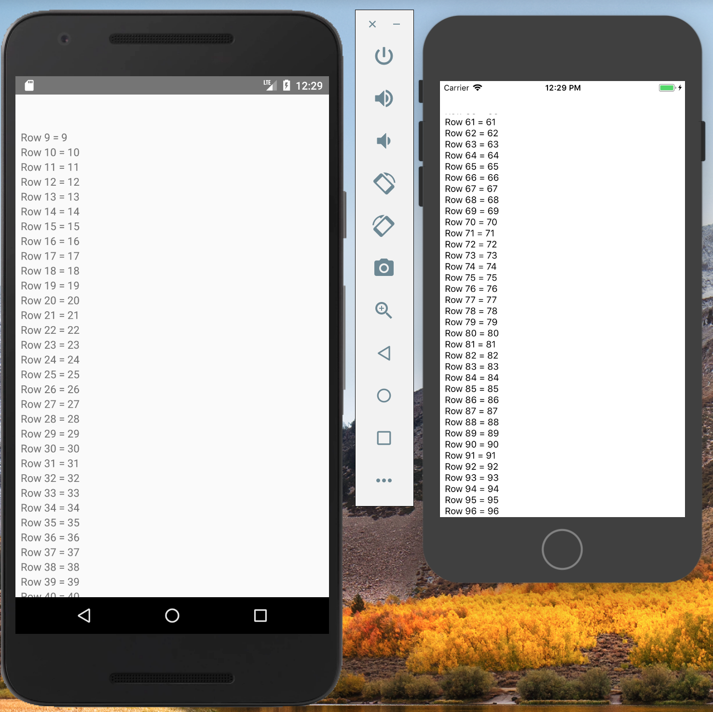
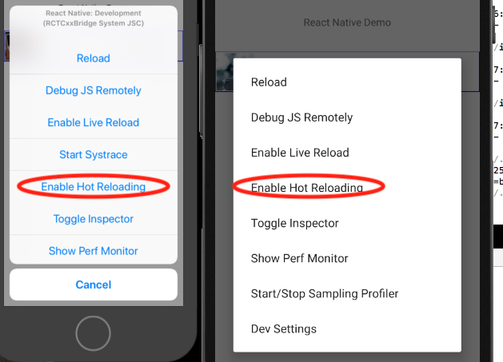
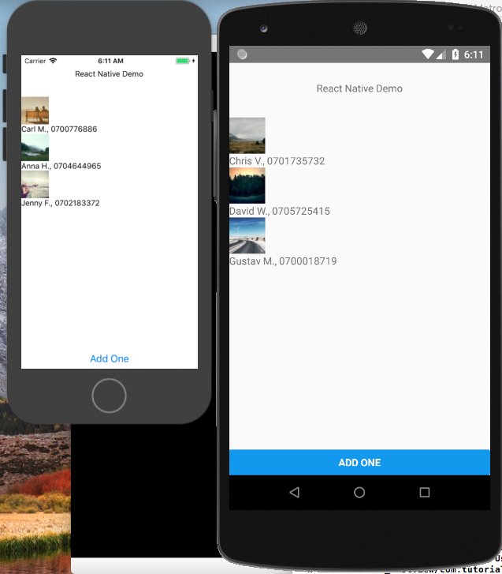

---
presentation:
  width: 1440
  height: 1280
  controls: false
---
<!-- slide -->
React Native
"Learn Once, Write Anywhere"

<!-- slide -->
Overview

* What is React Native
* Learn Once, Write Anywhere

* What is Expo
* How does React-Native work
* How does Expo work
* Hot Reload
* Static Checkers
  * flow
  * typescript
* Flexbox
* Shared Javascript with Server/Cloud
* Hooks to Native
  * Swift/Objective-C
  * Java/Kotlin
  * C/C++
* Available libraries
  * Maps (Google/Apple, etc.)
  * Vector-icons, Fonts, etc.
  * Buttons, video players, GPS trackers, etc.
* jsx examples

<!-- slide -->
### What is React-Native?

* Javascript engine for Mobile with direct hooks to native components supported on the mobile platform.
* iOS, Android, Windows Phone (in a branch)
* A React-Native App has literally ~~NO~~ one limitation~~s~~, as its support for native libraries means if you are lacking native support, you can implement it yourself.  <span style="font-size: 0.5em;">This is a lie - it is not suitable for anything with dynamic animations based on user feedback, like games, **yet**...</span>

#### Motto
~~Write Once, Run Anywhere~~
Learn Once, Write Anywhere

<!-- slide -->
### Where does it come from?

- Developed by Facebook
- Dogfooded by Facebook for Facebook app, Messenger, etc.
- Released open-source by Facebook to the world on one condition:
  - *You may not sue Facebook for patent infringement*
- Used by Facebook, WIX, Instagram, Uber, Discord, Bloomberg, Discovery VR, ...


<!-- slide -->
### How does it work I ?


<!-- slide -->
### How does it work II ?
</img>
- Runtime Environment: Javascript Core
- Most React-Native controls interact with a native counterpart
  - Pure-javascript components are obviously also supported and inherently cross-platform (but with a performance penalty, and they won't "look" native)
- React Native provides the bridge between JS and native
  - Events passed through the bridge between JS and native
- Native code runs in its own thread, so it won't block the UI thread.

<!-- slide -->
### How does it work III ?
</img>
- Pure Android/iOS application is compiled from source and deployed to phone. This application includes all necessary native components, including native Java/Kotlin/Obj-C/Swift/C++ libraries needed by the javascript.
- Node web server runs which holds all of the React-Native JavaScript code.
- In Debug mode, the JavaScript code bundled and transferred from the development PC to the phone via USB/WIFI/Ethernet/etc...
  - This enables **live reload** and **hot reload** on changes to the JavaScript UX.
- In Release mode, the JavaScript code is bundled as a blob included in the release app.

<!-- slide -->
### Why use React-Native (Pros)
- Rapid development
- Learn once, write anywhere
- "Normal" apps are not limited by the provided RN API
  - Huge community of 3rd party modules
  - Roll your own native modules
- Lean UX development
- Share javascript code between server and client
- One development team needed with Javascript competence, rather than separate Android/iOS teams
- Use native views, buttons, lists, video-players, camera app, gallery app, maps, etc, but from javascript, with the speed and integration that this entails.
- Distribute javascript code independently of app ("Expo").

<!-- slide -->
### React Native vs Expo
#### React Native
- A React Native project is created using react-native init <project_name>
- React Native project generates native Android and XCode projects which can be compiled from raw source code.
- Projects can be modified directly, you can distribute this app to app stores, you can modify the React Native library code, you can add native code, etc.
- You may need to know more about React Native than you really want to.
- Extra functionality is added by using yarn add <module> or npm install <module>

#### Expo
- An Expo project runs in the Expo App, a prebuilt app which can be downloaded from Google Play or iOS App Store.
- The Expo App is a pre-built react-native app including many native modules not included by default:
  - camera, push notifications, vector icons, etc...
- Expo's own build servers can be used to generate Android and iOS apps for release on Google Play or the iOS App Store.
- Must do "expo eject" if you want to modify any native libraries or add native code.

<!-- slide -->
### Example App 1
Setup:
Install the tools necessary to create a template React Native project from the command line.

```bash
npm install -g react-native-cli
```

- Create a new React-Native project called "AwesomeProject"

```bash

react-native init AwesomeProject
cd AwesomeProject
```

To build and run your new app on iOS:
```bash
react-native run-ios
```

To build and run your new app on Android:
```bash
react-native run-android
```

<!-- slide -->
### Example App 1

Copy and paste this code over your App.js code for a basic example of how to use a native ListView component on both Android and iOS.

```javascript
import React, {Component} from 'react';
import {Text, View, ListView} from 'react-native';

export default class App extends Component {
  constructor() {
    super()
    const ds = new ListView.DataSource({rowHasChanged: (r1, r2) => r1 !== r2});
    let numbers = [...Array(100)];
    numbers.map((value, index, array)=>{array[index] = index.toString();})
    this.state = {
      dataSource: ds.cloneWithRows( numbers )
    };
  }
  render() {
    return (
      <View>
        <Text style={{height: 50}}></Text>
        <ListView
          dataSource={this.state.dataSource}
          renderRow={(rowData:string, unused:string, index:string) =>
              <Text>  Row {index} = {rowData}</Text>}
        >
        </ListView>
      </View>
    );
  }
}
```

<!-- slide -->
### Reload the app to see changes

Reload the app: Shake your phone or:
#### IOS Simulator reload:
Click on the simulator and press CMD+R
#### Android Simulator reload:
From shell, type "adb shell input keyevent 82"
Then click on "Reload"


<!-- slide -->
#### Breakdown of the first app, part 1/2

```javascript
import React, {Component} from 'react';
import {Text, View, ListView} from 'react-native';

```

Imports what is needed from react and react native.

```javascript
export default class App extends Component {  
```
Exports the App Component by default, to any Components which import this file.
```javascript
  constructor() {
    super()
    const ds = new ListView.DataSource({rowHasChanged: (r1, r2) => r1 !== r2});
    let numbers = [...Array(100)];
    numbers.map((value, index, array)=>{array[index] = index.toString();})
    this.state = {
      dataSource: ds.cloneWithRows( numbers )
    };
  }
```
The constructor is called ONCE on app startup.
It creates a listview datasource with 100 elements in it.
<!-- slide -->
#### Breakdown of the first app, part 2/2
```javascript
  render() {
    // return JSX which defines the screen based on current state and props.
    return (
      <View>
        <Text style={{height: 50}}></Text>
        <ListView
          dataSource={this.state.dataSource}
          renderRow={(rowData:string, unused:string, index:string) =>
              <Text>  Row {index} = {rowData}</Text>}
        >
        </ListView>
      </View>
    );
  }
}
```

The render() function returns the jsx which defines the screen.
The list view component's props expect a function (renderRow) which knows how to display each row. We define this here too.

<!-- slide -->
### Flexbox

[Facebook's page on Flexbox](https://facebook.github.io/react-native/docs/flexbox) lets you play around with doing app layout with flexbox.

Flexbox lets you specify app screen layout loosely as ratios of screen or component size in your jsx code, and react-native will take care of stretching, shrinking,  centering, aligning, and wrapping, etc., components for you.

Flexbox in combination with hot-reload makes rapid UI design possible.

<!-- slide -->
### Live Reload and Hot Reload

#### Live Reload

- Watches your project file system for changes
- Automatically reloads the javascript bundle from scratch any time you save a file.  
- Useful if you are changing app logic that can effect global app state, where Hot Reload would fail.
- If you are tweaking a screen's layout, may require re-navigating to that screen on every change.

#### Hot Reload

- Watches your project file system for changes
- Updates the current screen without reloading the whole app
- Useful if you are only changing rendering components such as layouts, fonts, images, icons, colours, sizes, etc, that don't affect global app state.
- Sometimes, the app will fail on a hot reload as a new state variable is added or removed
  - Full app reload will restore the state.

<!-- slide -->
### Let's enable Hot Reload

- Enable hot reloading
  - Open the debug menu:
    - Shake the Phone (CMD+D or "adb shell input keyevent 82")
    - Select "Enable Hot Reloading"
    - 
- Now any time you make a change to the app and save it, your app's layout will update automagically.

<!-- slide -->
### Example App 2 - Contact List Code 1/2
We'll now create a fake contact list app, with a button to add a new random contact.
Paste this at the top of your App.js, above the component declaration.

```javascript
import React, {Component} from 'react';
import {Text, View, Button, ListView, Image} from 'react-native';

const first_names = ["Thomas", "Magnus", "Gustav", "Emi", "Emma", "Remya",
"Chris", "Ken", "Carl", "David", "Jörgen", "Johanna", "Anna", "Marie",
"Peter", "Jan", "Jenny", "Helene"];
const last_names = ["A.","B.","C.","D.","E.","F.","G.","H.","I.","J.","K.",
"L.","M.","N.","O.","P.","Q.","R.","S.","T.","U.","V.","W.","X.","Y.","Z."];
const borders = { borderColor:'blue', borderWidth:1 };

function getRandom(max){
  return Math.floor((Math.random() * max));
}
function getName(){
  let rnd = getRandom(first_names.length);
  let name:string = first_names[rnd];
  rnd = getRandom(last_names.length);
  name += " " + last_names[rnd];
  return name;
}
function getPic(){
  let url = "https://picsum.photos/50/50/?image=";
  url += getRandom(200).toString();
  return url;
}
function getNumber(){
  let number = "070";
  for (let i = 0; i < 7;i++){
    number += getRandom(10).toString();
  }
  return number;
}
```

<!-- slide -->
### Example App 2 - Contact List Code 2/2
Replace the inside of your App component with the following code.
```javascript
  constructor() {
    super()
    this.ds = new ListView.DataSource({rowHasChanged: (r1, r2) => r1 !== r2});
    this.state = { contacts:[], ds:[] };
    this.state = this.addOneContact(true);
  }
  addOneContact(isConstructor){
    let contact = {name:getName(), number:getNumber(), pic:getPic()};
    let contacts = [...this.state.contacts, contact];
    let ds = this.ds.cloneWithRows(contacts);
    let newState = {contacts:contacts, ds:ds};
    if (!isConstructor){
      this.setState(newState); // can't call setState from constructor.
    }
    return newState;
  }
  renderRow(rowData, unused, index){
    return (
      <View>
        <Image style={{width: 50, height: 50}} source={{uri: rowData.pic}} />
        <Text>{rowData.name}, {rowData.number}</Text>
      </View>
    );
  }
  render() {
    return (
      <View style={{flex:1, alignItems: 'stretch'}}>
        <ListView style={{flex:1}} dataSource={this.state.ds}
          renderRow={(rowData, unused, index) => {
            return this.renderRow(rowData, unused, index);}} />
        <Button title="Add One"
          onPress={()=>{this.addOneContact()}} style={{alignSelf:'center'}} />
      </View>
    );
  }
```

<!-- slide -->
### It works, but it's ugly


Let's fix it up.

<!-- slide -->
### Let's use styles and flexbox.
Replace renderRow() with the following code.
```javascript
renderRow(rowData, unused, index){
  return (
    <View style={{...borders, flexDirection:'row', alignItems:'center'}}>
      <Image style={{margin:1, width: 51, height: 51}}
        source={{uri: rowData.pic}} />
      <Text style={{flex:1, marginLeft:10}}>{rowData.name}</Text>
      <Text style={{flex:1}}>{rowData.number}</Text>
    </View>
  );
}
```

<!-- slide -->
### React-Native Cons
- Environment setup
- Developing in Windows is a piece of #@&%!
  - Slow build time
  - Can only build for Android
  - Path length limitations in Windows OS
- **Dependencies must be continually updated**
  - Android Dependencies
    - Android Studio, Android Build Tools, Gradle, Java, Kotlin, Gradle, Gradle, Gradle
  - XCode Dependencies
    - Swift language, Swift libraries, Swift deprecation
  - RN Dependencies.
    - Need latest RN to support latest XCode to support latest iPhone, but latest RN breaks native module camera, GPS, and maps.
    - Need latest RN to support latest Android Studio, but that breaks native module soundplayer, imageshrinker, and cow pusher.
  - Workaround 1: Most 3rd party modules are published on github, so you can wait until the author publishes a fix, or fix it yourself and be a hero.
  - Workaround 2: Wait before upgrading your build tools/XCode/Android Studio
  - Workaround 3: Lock all native module versions and javascript in your package.lock.
  - Workaround 4: Use **Expo**
