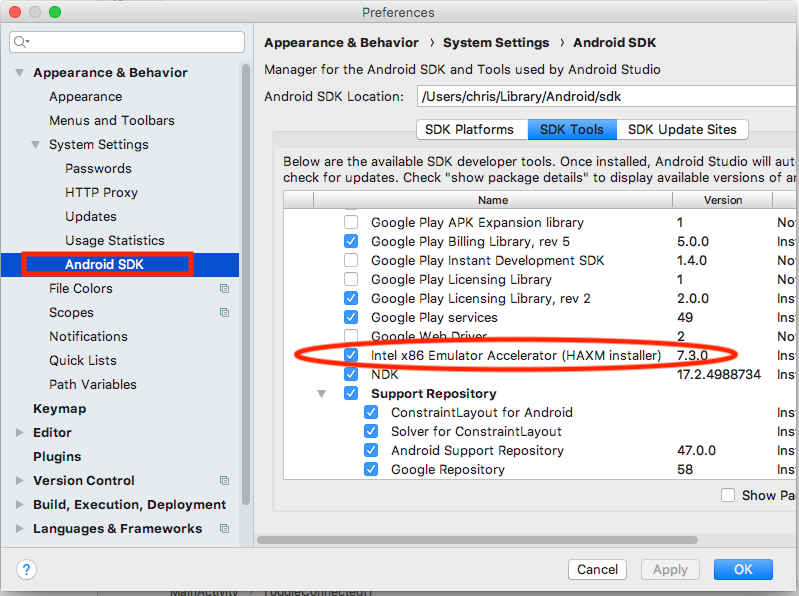
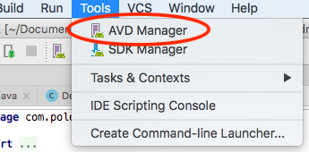
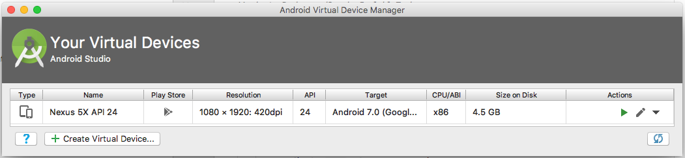
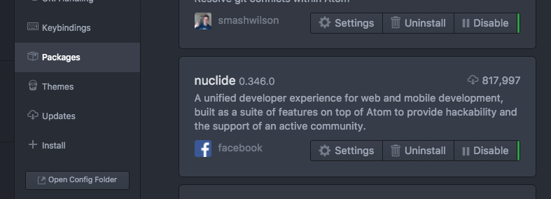
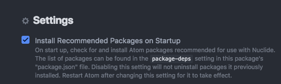
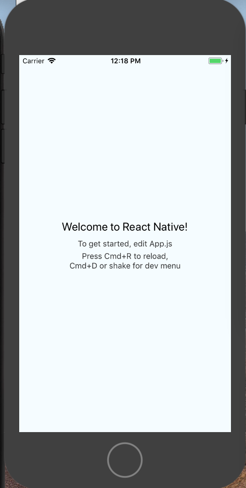
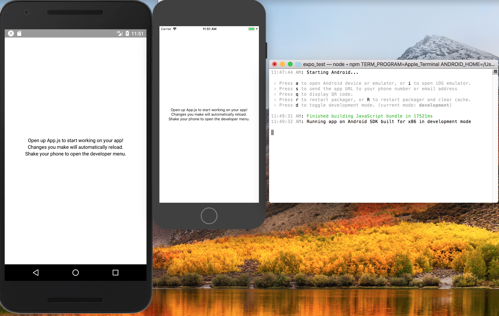
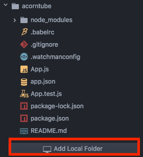

# React-Native Tutorial Prerequisites

You need to be able to run a default app in order to follow along with the course.

As react-native is Facebook's own open-source development platform, we will use
their own development tools, so will install the tools recommended by Facebook.  

## Operating Systems
OSX is the best platform for developing RN apps, as it supports iOS and Android, and also has the most support from facebook.  
Linux is the second best platform for developing RN apps, but obviously only supports Android and has worse performance as it is missing the hooks used by OSX to notify the IDE of file changes.
Windows is supported, but only for Android apps, and is definitely the worst experience, as the build step is slow, path lengths are limited, among other issues.
(If you are on OSX, you may use [homebrew](https://brew.sh/) to install many of these tools.)

## Development tools

### Android
- Install [Android Studio](https://developer.android.com/studio/) to develop Android apps.
  - If you want to run Android Apps in a simulator, install HAXM and create an x86 AVD using the SDK manager and AVD manager.
    - Install HAXM (Android Studio-->Preferences, select "Android SDK in the left menu and "SDK Tools" on the right side)
      - It might already be installed together with Android Studio, in which case you don't need to install it again.   
    - 
    - The easiest way to get to the AVD manager is to open an Android Studio project (or create a new one) and then the menu item for the AVD will be available once the project opens.
    - 
    - Create an x86 AVD, which has best performance on X86 development machines.  You can just accept the defaults. I created one with these options, which worked fine.
    - 

- Check that your default path points to adb (Android Debug Bridge), so that you can run it from the command line.  adb is stored in <android_sdk>/platform-tools/

### iOS  
- From the OSX App Store, install Xcode and the Xcode command line utilities to develop iOS apps.

### Node + NPM
Install [node and npm](https://www.npmjs.com/), following the instructions for your platform.

### Watchman
Install [watchman](https://facebook.github.io/watchman/docs/install.html)

### react-native-cli and expo-cli

React-native CLI is used to generate a template react-native app, and expo-cli is used to generate a template expo app.

We will discuss the difference between the two of these in the tutorial.

Setup:
Install the tools necessary to create template projects from the command line using npm.

```bash
npm install -g react-native-cli
npm install -g create-react-native-app
npm install -g expo-cli
npm install -g yarn
```

### Atom IDE with Nuclide

#### Atom
Install [atom](https://ide.atom.io/)

##### Nuclide plugin for atom

Install the [nuclide plugin for atom](https://nuclide.io/docs/editor/setup/)

Open atom and select Atom-->Preferences-->Packages, then find nuclide and click "Settings"



After clicking nuclide->settings, ensure "Install Recommended Packages on Startup" is checked.



Now close Atom, then reopen it. Nuclide will install all recommended tools for react-native development.

##### Nuclide server npm plugin (optional)

This tool allows you to get a full nuclide development experience on Windows, but requires that you host the files on a remote OSX/Linux nuclide server.  Both the server nuclide version and client nuclide version must match.

npm install -g nuclide

#### 1.0 Test your new development environment 1.

- Create a pure React-Native project called "tutorial_1"

```bash

react-native init tutorial_1
cd tutorial_1
```

##### 1.0.1 THEY BROKE STUFF YESTERDAY. DO THIS**

```bash
npm install --save-dev @babel/plugin-external-helpers
```

##### 1.0.2 THEY BROKE MORE STUFF YESTERDAY. DO THIS IF YOU HAVE UPGRADED TO XCODE10 AND WANT TO BUILD IN IOS**
1. Open the project in XCode
1. Go to File > Project Settings
1. Change Build System to Legacy Build System

#### 1.1
To build and run your new app on iOS:
```bash
react-native run-ios
```

#### 1.2
To build and run your new app on Android:
```bash
react-native run-android
```

The "Hello" app should start running on your phone or in your simulator. The first part of the tutorial will start from this generated source code.



If you get an "sdk not found" error, refer to the [troubleshooting](#android-cannot-find-the-sdk) tips at the bottom of this document.

#### Test your new Expo development environment

Expo is an iOS/Android app which can be downloaded from the AppStore/Play Store and includes a bunch of pre-built and tested native modules.  The expo-cli will automagically install it on your emulator/phone when you run your app (and this process can take several minutes, so be patient!)  If you have trouble getting the Expo app running in your simulator or on your phone, follow the instructions [here](https://docs.expo.io/versions/latest/introduction/installation)

- Create an expo project called "acorntube"

```bash
create-react-native-app acorntube
cd acorntube
```

To build and run your new app in the expo app on your emulator or phone:
```bash
npm start
```

You should be able to get both template apps up and running by following the prompts that appear in the command line.



Open Atom, and in the tree to the left, click "Add Local Folder," navigate and select your new "acorntube" folder.



Double click on "App.js" to open the source code, which will look like this:

```jsx
import React from 'react';
import { StyleSheet, Text, View } from 'react-native';

export default class App extends React.Component {
  render() {
    return (
      <View style={styles.container}>
        <Text>Open up App.js to start working on your app!</Text>
        <Text>Changes you make will automatically reload.</Text>
        <Text>Shake your phone to open the developer menu.</Text>
      </View>
    );
  }
}

const styles = StyleSheet.create({
  container: {
    flex: 1,
    backgroundColor: '#fff',
    alignItems: 'center',
    justifyContent: 'center',
  },
});
```

Try changing "backgroundColor" to 'red' and saving App.js.  Your app's background colour should automatically change to red.

```jsx
const styles = StyleSheet.create({
  container: {
    flex: 1,
    backgroundColor: 'red',
    alignItems: 'center',
    justifyContent: 'center',
  },
});
```

The second part of the react-native tutorial will start with this template code.

## YouTube API key

If you haven't already, please create an API key and bring it with you to the tutorial.

  * Go to http://console.developers.google.com (You will need to login with your google account - if you don't have any, sign up for one for free)
  * Click `Menu` -> `API Manager`
  * Click `Youtube Data API v3` -> `Enable API`
  * Click `Credentials` -> `New Credentials` -> `API key` -> `Browser key`
  * Click `Create`
  * Copy the generated and key and store it so you can easily access during the upcoming tutorial

# Finished!

Congratulations, you are ready for the tutorial!

## Appendix: Troubleshooting

### 'Shake' an android simulator

```bash
adb shell input keyevent 82
```

Uses Android Debug Bridge (ADB) to "shake" the phone.

### Connect npm javascript bundler to an android phone

If you get the red-screen error message about running adb reverse, run adb reverse:

```bash
adb reverse tcp:8081 tcp:8081
```

This allows the javascript server running on your PC to connect via Android Debug Bridge (ADB).

### Android Cannot find the SDK

If build steps can't find the SDK, it probably means that it isn't in your path.  You can either place it in your path, or you can create a local.properties directory under android/ in the project directory.

android/local.properties for OSX
```bash
sdk.dir = /Users/<USERNAME>/Library/Android/sdk
```

android/local.properties for Windows
```bash
sdk.dir = C:\\Users\\<USERNAME>\\AppData\\Local\\Android\\sdk
```

android/local.properties for linux
```bash
sdk.dir = /home/<USERNAME>/Android/Sdk
```
