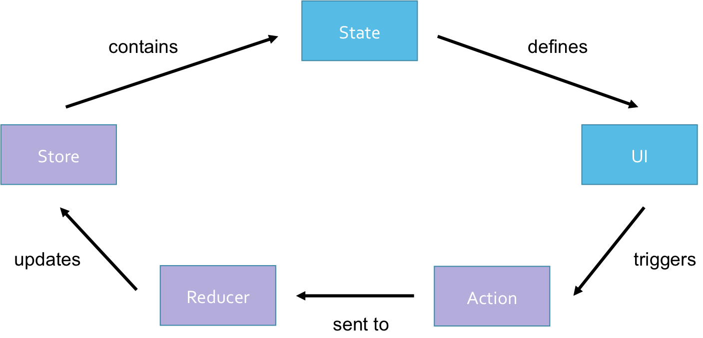
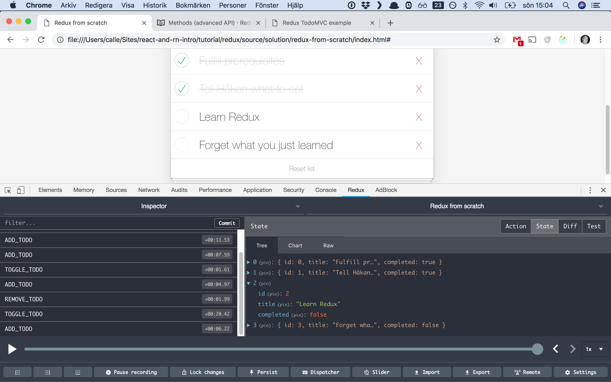
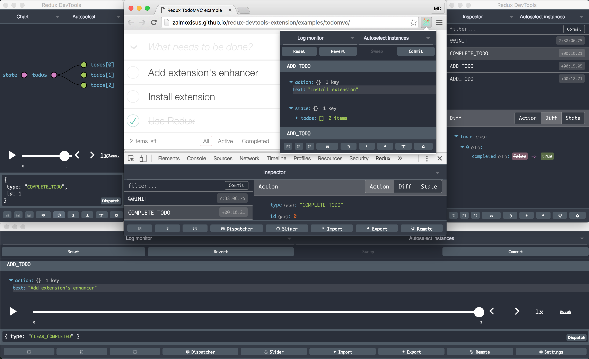

# Redux

Yay.

## Prerequisites

Good news! You barely have to install anything this time! It's the same prerequisites as the first session. So if you bring the same computer, you should be good to go. The only thing I ask you to is to make sure that you have a *working* video player app. If you didn't have the time to finish the app from the React session, clone the repo here:
`https://github.com/appsupport-at-acorn/react-and-rn-intro` and navigate into `tutorial/redux/source/start/my-app`. and run `npm install` and `npm start` and hopefully you should see the app appearing.

I decided to move the YouTube API key to a separate file to avoid passing keys around. Please create a file called `api-key.json` next to `app.js` and add the following code and insert your key:

    {
        "API_KEY": "<my-youtube-key>"
    }

## Re-cap from the React session

In the video player app, we communicate via callbacks (props) between parent and child components in multiple levels:

The `App` component provide a prop called `onVideoSelect` to its child component `VideoList`, which is a callback setting the state as seen below:

    <VideoList onVideoSelect={selectedVideo => this.setState({selectedVideo})}>

The `VideoList` component just passes this prop on to its child `VideoListItem`:

    <VideoListItem onVideoSelect={props.onVideoSelect}>

And then finally `VideoListItem` uses this callback each time an item is clicked:

    <li onClick={() => onVideoSelect(video)}>

In the video player app, we also have these lines:

    // [app.js]
    this.state = {
        videos: [],
        selectedVideo: null
    };

    // [search-bar.js]
    this.state = {searchTerm: ''};

That was our combined initial state!

Translated into a single plain JavaScript object, the above could be expressed as:

    {
        searchTerm: '',
        videos: [],
        selectedVideo: null
    }

In the Redux world, the above would be referred to as *data state*. Of course there are more things in the application that *could* be included in the state depending on how detailed one would like to be, but since it's often data that drives state, we will only consider this type of state in this tutorial.

Okay, that was a little bit about the current status of the application. Now it's time to do some coding!

## Redux from scratch

We will now implement Redux from scratch so that you will get a good understanding of the pattern. I'm encouraging you to think about the pattern and concepts we've been talking about and not just copy-pasting the code.

Start off by opening the project in your editor of choice.

Our `app.js` should look like something like this:

    class App extends Component {

        constructor(props) {
            super(props);

            this.state = {
                videos: [],
                selectedVideo: null
            };

            this.videoSearch('acorntechnology');
        }

        // ...
    }

We can clearly see the App component's state defined here, but since we from now on will try to follow the Redux pattern, let's move it to where Redux stores its state - the store.

Create a function called `createStore()` with an empty state in it:

    createStore() {
        let state = {};
    }

Then, add a variable called store to our App component so that it looks like this:

    class App extends Component {
        store = {};

        constructor(props) {
        // ...
    }

Create the store in the constructor:

    this.store = this.createStore();

 Begin thinking a little bit about the actions we might need. What kind of interactions can the user currently perform in the app? Issuing new search queries to the YouTube API is one thing, so let's start with that.

Create a file called `actions.js`:

    export const SEARCH_YOUTUBE = 'SEARCH_YOUTUBE';

Import the file into `app.js`:

    import * as actions from './actions.js';

What else do we need?

We would like to dispatch this action somehow, right? Let's add a dispatch function to our store.

    function dispatch(action) {
        console.log('Dispatching action', action);
    }

And call it in the `videoSearch()` function:

    this.store.dispatch(actions.SEARCH_YOUTUBE);

If you run the application by issuing `npm start` in the terminal, you should now get an error in the browser console saying:

"Cannot read property 'dispatch' of undefined"

Our store doesn't expose it yet, so let it return an object containing the function, like this:

    return { dispatch };

***

Remember that an action is a plain JavaScript object containing the type of action and a payload. Right now it's just dispatching a string and not an object. An action could look like:

    {
        type: actions.SEARCH_YOUTUBE,
        payload: 'Funniest cat compilation ever made'
    }

Let's change the dispatch-call:

    this.store.dispatch({
        type: actions.SEARCH_YOUTUBE,
        searchTerm
    });

**NOTE:** Only writing `searchTerm` like above is a shorthand for writing `searchTerm: searchTerm`.

Okay, look again in the console and you will see that we now receive the full object with the payload as well. Great!

## Using the Redux library
`npm install redux`

## Redux DevTools Extension

Install Redux DevTools Extension in the browser by following the instructions here: https://github.com/zalmoxisus/redux-devtools-extension

As you will see, you will be able to do lots of cool things!

## Using the official React bindings for Redux

`npm install react-redux`

`connect()`

## Further improvements

Maybe?