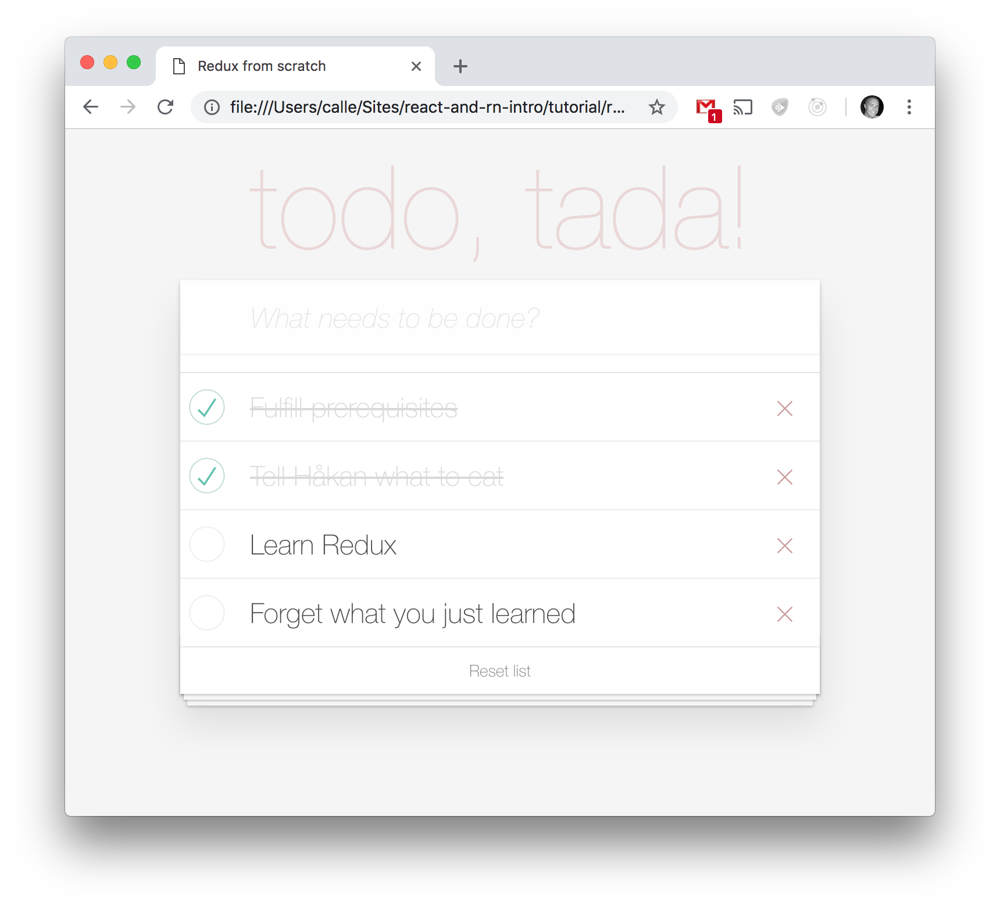

# Redux

Welcome to the Redux tutorial! Focus is going to be on understanding the pattern, have a look at some DevTools, and using Redux in our React video player application.

## Prerequisites

Good news! You barely have to install anything this time! It's the same prerequisites as the first session. So if you bring the same computer, you should be good to go. The only thing I ask you to do is to make sure that you have a *working* video player app. If you didn't have the time to finish the app from the React session, clone the repo here:
https://github.com/appsupport-at-acorn/react-and-rn-intro and navigate into `tutorial/redux/source/start/my-app`. Update your YouTube API-key in `app.js` and run `npm install` and `npm start`, just to see that the app is working.

## Redux from scratch

We will now implement Redux from scratch so that you will get a good understanding of the pattern and how the different plugins and binding libraries in the Redux ecosystem work under the hood. I'm encouraging you to think about the pattern and concepts we've been talking about and not just copy-pasting the code.

 

 

There's one important statement to make here. React, like we discussed in the first session, has a virtual DOM that contains a clever diffing algorithm that optimizes repaints of the page based on when the state changes. Implementing Redux from scratch together with React would be very cumbersome, because we cannot call the `render()` function manually (the components would simply loose their state if we try to do that).

Instead, we'll just go plain vanilla in this first exercise. Unfortunately we cannot re-use the JSX components and HTML markup that we created last time, and for the sake of simplicity another domain has been chosen - the classical **TODO** app. I've prepared a pretty UI for you, no worries. Save [this](./source/solution/redux-from-scratch/index.html) file somewhere (location doesn't matter) and open it in your browser. Be aware that there will be no live-reload on that page so you'd have to hit F5 to see your changes.

What we will try to build is this:

 

 

Open the file in an editor of your choice and create a new empty file named `app.js` next to it.

Begin thinking a little bit about the *actions* we might need. We can obviously add todos. There's a reset-button, and it also seems possible to remove todos and mark them as completed. Okay, so let's define the following four actions:

    const ADD_TODO      = 'ADD_TODO';
    const REMOVE_TODO   = 'REMOVE_TODO';
    const TOGGLE_TODO   = 'TOGGLE_TODO';
    const RESET_TODOS   = 'RESET_TODOS';

Then we continue with the heart of Redux - the *store*. Create a function called `createStore()` with an empty state in it:

    function createStore() {
        let state = [];
    }

Create a function called `init()` that's going to be our starting point in the application and call it right after its declaration. In `init()`, add a variable called `store` to the `windows`-object that calls `createStore()`:

    window.store = createStore();

We would like to dispatch our actions somehow, right? Let's add a dispatch function to our store.

    function dispatch(action) {
        console.log('Dispatching action', action);
    }

Try dispatching one of the actions now:

    store.dispatch(ADD_TODO);

You will see an error saying `Uncaught TypeError: Cannot read property 'dispatch' of undefined`. Our store doesn't expose it yet, so let it return an object containing the function, like this:

    return { dispatch };

Our `createStore()`-function should now look like this:

    function createStore() {
        let state = [];

        function dispatch(action) {
            console.log('Dispatching action', action);
        }

        return { dispatch };
    }

You should now see in the console that the action was dispatched.

***

Remember that an action should be a plain JavaScript object containing the type of action and a payload. Right now it's just dispatching a string and not an object. An action could look like:

    {
        type: ADD_TODO,
        title: 'Buy bananas'
    }

Let's change the dispatch-call:

    store.dispatch({
        type: ADD_TODO,
        title: 'Buy bananas'
    });

Okay, look again in the console and you will see that we now receive the full object with the payload as well. Great!

We will need to add more functions to the store in just a little bit, but let's define the last concept of the Redux pattern: the *reducer*.

It's a function that takes the previous (or current) state and an action, and returns a new state. Easy peasy.

    function reducer(state, action) {
        return state;
    }

The above reducer is perfectly valid. It is pure and will always return the same output no matter the input, but it doesn't do anything yet :-)

Let's continue with an implementation of the `ADD_TODO`-action:

    function reducer(state, action) {
        console.log('Inside the reducer with state ', state, 'and action', action);

        switch (action.type) {
            case ADD_TODO:
                return [...state, {
                    id: state.length,
                    title: action.title,
                    completed: false
                }];
            default:
                return state;
        }
    }

Pay attention to the spread-operator (...) above. It's the same thing as literally spreading out all elements (if used on an array) or properties (if used on an object). It's a quick way to add elements to an array or modify properties of an object. If we would use `Array.push()` we would mutate the state and not return a new one, and we would get accused of breaking the law of immutability. Some quick examples of the spread operator if you haven't seen it before:

    const a = [1,2];
    const b = [...a, 3]; // [1,2,3]

 

    const a = {foo: 'foo', bar: 'bar'};
    const b = {...a, foo: 'haz'}; // {foo: 'haz', bar: 'bar'}

Enough JavaScript mumbojumbo. Now, in order for the store to be able to update its state, it has to call the reducer. Let's pass it a reference to it.

    window.store = createStore(reducer);

Don't forget to update the `createStore()`-function to receive a `reducer` and then in the `dispatch()`-function add a line that updates the state with the value returned by the reducer:

    state = reducer(state, action);

Time to have a look in the console. You should see two logs, one from the dispatch call and one from when the reducer receiving the action together with the current state.

***

I know, there's nothing really exciting going on here yet. Patience my friends :-)

For debugging purposes, it would be good to see our current state object on the page while developing.

Create (and expose by returning) a `getState()`-function in our store that simply returns `state`:

    function getState() {
        return state;
    }

In the end of the `dispatch()`-function, add this line:

    document.getElementById('debug').innerHTML = JSON.stringify(this.getState());

Reload the page and you will see the current state object displayed on the page!

***

Wouldn't it be better if that todo is visible in the UI? Of course it would. Let's create a `render()`-function, similar to the one in React that also receives a reference the store as an input:

    function render() {
        const listElement     = document.getElementById('list');
        listElement.innerHTML = '';

        store.getState().forEach(item => {
            const itemElement = document.createElement('li');

            itemElement.innerHTML = `
                <li class="${item.completed ? 'completed' : ''}">
                    

                        <input class="toggle" type="checkbox" onClick="toggleTodo(${item.id});" ${item.completed ? 'checked': ''}>
                        <label>${item.title}</label>
                        <button class="destroy" onClick="removeTodo(${item.id})"></button>
                    

                </li>
            `;

            listElement.appendChild(itemElement);
        });
    }

This might look a bit intimidating at first, but all it does is looping through the state and creating list items (`<li>`'s) for each todo.

Refresh the page. Nothing should have changed. We need to call the `render()`-function. Or in other words, our app or "component" needs to subscribe to the store, and the store needs to notify its listeners.

Add an array of listeners to the `createStore()`-function:

    const listeners = [];

Then, add (and expose) the `subscribe()`-function to the store:

    function subscribe(listener) {
        listeners.push(listener);
    }

We also need to actually notify the listeners when something has changed, which is after the state has been updated in the `dispatch()`-function:

    listeners.forEach(listener => listener());

Your complete `createStore()` should now look like this:

    function createStore(reducer) {
        let state       = [];
        const listeners = [];

        function getState() {
            return state;
        }

        function dispatch(action) {
            state = reducer(state, action);
            listeners.forEach(listener => listener());
        }

        function subscribe(listener) {
            listeners.push(listener);
        }

        return { getState, dispatch, subscribe };
    }

Subscribe to the store using our `render()`-function right after it has been created:

    store.subscribe(render);

Refresh the browser and sing Halleluja - we've just implemented Redux from scratch. You have a todo saying Buy bananas!

***

Interactivity plz! Okay I know, let's unlock the other features of this fancy application.

We need event handlers to hook up the UI with dispatching events instead of doing this programatically. Remove the `store.dispatch()`-call that told you to buy bananas.

Add this function:

    function attachEventHandlers(store) {
        const formElement         = document.getElementById('form');
        const inputElement        = document.getElementById('input');
        const resetButtonElement  = document.getElementById('resetButton');

        inputElement.focus();

        form.addEventListener('submit', () => {
            if (inputElement.value) {
                store.dispatch({
                    type: ADD_TODO,
                    title: inputElement.value
                });
            }

            inputElement.value = '';
        });

        resetButtonElement.addEventListener('click', () => store.dispatch({
            type: RESET_TODOS
        }));
    }

And call it from the `init()`-function:

    attachEventHandlers(store);

Add these two functions that help the view dispatching actions:

    function toggleTodo(id) {
        store.dispatch({
            type: TOGGLE_TODO,
            id: id
        });
    }

    function removeTodo(id) {
        store.dispatch({
            type: REMOVE_TODO,
            id: id
        });
    }

If you feel like it, feel free to implement the logic for reducing the other actions yourself. In that case, don't look at this code :-)

    function reducer(state, action) {
        switch (action.type) {
            case ADD_TODO:
                return [...state, {
                    id: state.length,
                    title: action.title,
                    completed: false
                }];

            case REMOVE_TODO:
                return state.filter(item => item.id !== action.id);

            case TOGGLE_TODO:
                return state.map(item => {
                    if (item.id === action.id) {
                        item.completed = !item.completed;
                    };

                    return item;
                });

            case RESET_TODOS:
                return [];

            default:
                return state;
        }
    }

Hit F5 and play around a bit!

## Using the Redux library and Redux DevTools Extension

Normally, you would install the Redux lib through `npm` by running `npm install redux`, but for the sake of this demo, it's already linked from a CDN. If you look in `index.html` you can see a reference to `redux.min.js`, which will make it available on the `windows`-object, so we don't have to install anything.

You will now keep the actions and reducers that you wrote. The only thing that will change is `createStore()`. We will replace our implementation with Redux's.

Comment out your whole `createStore()`-function and replace the call to it with this:

    window.store = window.Redux.createStore(reducer, []);

Reload the page and you should now get...the same result! Should we be surprised? No. Redux is a tiny library landing at only 99 lines of code. But we have now seen that we could implement it ourseleves. Cool huh?

But what else does this lib do for us? The point is that it exposes some functionality for others to plug in to, as we will see in the next chapter.

### Redux DevTools Extension

Now that we're using Redux's `createStore()`, a browser extension called Redux DevTools Extension will know how to hook up to our store and provide a lot of nice features!

Install the extension by following the instructions using the first option for the browser you are running: https://github.com/zalmoxisus/redux-devtools-extension

> NOTE 1 (for Chrome): In order for it to work when we're running without a server (i.e. using the file:///-protocol), you must configure the extension to allow such access:
https://github.com/zalmoxisus/redux-devtools-extension/blob/master/docs/Troubleshooting.md#access-file-url-file

> NOTE 2: You might have to restart your browser for things to kick in.

Oh and by the way, we can remove our own debugging panel now, delete this line in `index.html`:

    

If you now refresh your browser you should see a new section in the browser DevTools called *Redux*. However, it says `No store found`. We need to provide a third argument to `createStore()` that adds this stuff as an *enhancer*, which is something that is similar to middleware, but let's leave it there.

Again, change your `createStore()`-call to the following:

    window.store = window.Redux.createStore(reducer, [], window.__REDUX_DEVTOOLS_EXTENSION__ && window.__REDUX_DEVTOOLS_EXTENSION__());

As you will now see if you hit F5, you will be able to do lots of cool things here like:

* Investigating the state
* Seeing what changed between actions
* Time travel debugging
* Importing/exporting state object
* Dispatching actions
* etc.

 

## Using React with Redux

So far we haven't touched React. Why? Because it would be hard to write all the wiring needed from scratch. React has its own virtual DOM and `render()`-function that should not be called manually. And remember that Redux is a general pattern and has no relation to React, although they fit very well together.

Let's get back to our video player app!

***

### Re-cap from the React session

In the app, we communicate via callbacks (props) between parent and child components in multiple levels:

The `App` component provide a prop called `onVideoSelect` to its child component `VideoList`, which is a callback setting the state as seen below:

    <VideoList onVideoSelect={selectedVideo => this.setState({selectedVideo})}>

The `VideoList` component just passes this prop on to its child `VideoListItem`:

    <VideoListItem onVideoSelect={props.onVideoSelect}>

And then finally `VideoListItem` uses this callback each time an item is clicked:

    <li onClick={() => onVideoSelect(video)}>

In the video player app, we also have these lines:

`search-bar.js`:

    this.state = {searchTerm: ''};

`app.js`:

    this.state = {
        videos: [],
        selectedVideo: null
    };

Those two objects combined is our initial state.

Translated into a single plain JavaScript object, the above could be expressed as:

    {
        searchTerm: '',
        videos: [],
        selectedVideo: null
    }

In the Redux world, the above would be referred to as *data state*. Of course there are more things in the application that *could* be included in the state, but since it's often data that drives state, we will only consider this type of state in this app.

Okay, that was a little bit about the current status of the application. Now it's time to introduce Redux to it to get rid of these callbacks and also be able to use the Redux DevTools Extension to track state changes over time.

***

### Install Redux and the React bindings

In the root of the project directory (where you execute `npm start` from), run:

    npm install redux react-redux --save

Open the project in your editor.

> NOTE: More intimidating concepts will be introduced here, but they are all React-Redux-specific.

The API of the `react-redux`-lib contains two main parts:

* `<Provider store>`
* `connect([mapStateToProps], [mapDispatchToProps], [mergeProps], [options])`

`<Provider>` is a component that makes the Redux store available to the rest of your app.

`connect()` is a function which encapsulates the process of talking to the store.

It enables you to:

* Read data from the Redux store into your app's connected components as props
* Dispatch actions to your store from any of your app's connected components

Correspondingly, the `connect()`-function takes two arguments, both optional:

TODOOOO

connect takes in two parameters. The first one allows you to define which pieces of data from the store are needed by this component. The second one allows you to indicate which actions that component might dispatch. By convention, they are called mapStateToProps and mapDispatchToProps, respectively.

* `mapStateToProps`: called every time the store state changes. It receives the entire store state, and should return an object of data this component needs.

* `mapDispatchToProps`: this parameter can either be a function, or an object.
    * If it's a function, it will be called once on component creation. It will receive dispatch as an argument, and should return an object full of functions that use dispatch to dispatch actions.
    * If it's an object full of action creators, each action creator will be turned into a prop function that automatically dispatches its action when called. Note: It's recommended to use this "object shorthand" form.

Normally, you would call connect in this way:

    const mapStateToProps = (state, ownProps) => ({
        // ... computed data from state and optionally ownProps
    });

    const mapDispatchToProps = {
        // ... normally is an object full of action creators
    };

    // `connect` returns a new function that accepts the component to wrap:
    const connectToStore = connect(
        mapStateToProps,
        mapDispatchToProps
    );
    // and that function returns the connected, wrapper component:
    const ConnectedComponent = connectToStore(Component);

    // We normally do both in one step, like this:
    connect(
        mapStateToProps,
        mapDispatchToProps
    )(Component);

***

Open `index.js`. It should look like this since last time:

    ReactDOM.render(<App />, document.getElementById('root'));

Wrap `<App>` in a `<Provider>` and add some imports, like so:

    import { Provider } from 'react-redux';
    import store from './store';

    ReactDOM.render(
        <Provider store={store}>
            <App />
        </Provider>,
        document.getElementById('root')
    );

If you have the app running, it will now complain about not finding the store.

So let's go ahead and import redux and call `createStore()`, and also pass references to the reducer (which we have not yet created) and the Redux DevTools Extension enhancer:

    import { createStore } from 'redux';
    import reducer from './reducer';

    const store = createStore(reducer, window.__REDUX_DEVTOOLS_EXTENSION__ && window.__REDUX_DEVTOOLS_EXTENSION__());

Before we create the reducer, think about what *actions* we might need. What kind of interactions can the user currently perform in the app? Issuing new search queries to the YouTube API is one thing, so let's start with that.

Create a filed called `actions.js` in the `src` directory and add the following:

    export const SEARCH_YOUTUBE = 'SEARCH_YOUTUBE';

Now, when using Reux with React, it's common to use something called *action creators*. It's simply functions that return actions. Let's create one for this action in the same file:

    export const searchYoutube = data => {
        console.log('Inside action creator searchYoutube', data);

        return {
            type: SEARCH_YOUTUBE,
            searchTerm: data
        };
    };

Create a filed called `reducer.js` in the same folder as `index.js`.

Let's declare an initial state in it and the reducer function itself with one action:

    const initialState = {
        searchTerm: '',
        videos: [],
        selectedVideo: null
    };

    export default function(state = initialState, action) {
        console.log('Inside the reducer with state ', state, 'and action', action);

        switch(action.type) {
            case actions.SEARCH_YOUTUBE:
                return {...state, searchTerm: action.searchTerm};
            default:
                return state;
        }
    }

***

Implementing Container Components
Now it's time to hook up those presentational components to Redux by creating some containers. Technically, a container component is just a React component that uses store.subscribe() to read a part of the Redux state tree and supply props to a presentational component it renders. You could write a container component by hand, but we suggest instead generating container components with the React Redux library's connect() function, which provides many useful optimizations to prevent unnecessary re-renders.

To use connect(), you need to define a special function called mapStateToProps that describes how to transform the current Redux store state into the props you want to pass to a presentational component you are wrapping. For example, VisibleTodoList needs to calculate todos to pass to the

====================

TODOOOOO:

Our `app.js` should look like something like this:

    class App extends Component {

        constructor(props) {
            super(props);

            this.state = {
                videos: [],
                selectedVideo: null
            };

            this.videoSearch('acorntechnology');
        }

        // ...
    }

We can clearly see the App component's state defined here, but since we from now on will try to follow the Redux pattern, let's move it to where Redux stores its state - the *store*.

Create a function called `createStore()` with an empty state in it:

    createStore() {
        let state;
    }

Then, add a variable called store to our App component so that it looks like this:

    class App extends Component {
        store = {};

        constructor(props) {
        // ...
    }

Create the store in the constructor:

    this.store = this.createStore();

Begin thinking a little bit about the *actions* we might need. What kind of interactions can the user currently perform in the app? Issuing new search queries to the YouTube API is one thing, so let's start with that.

Add the following
    export const SEARCH_YOUTUBE = 'SEARCH_YOUTUBE';

We would like to dispatch this action somehow, right? Let's add a dispatch function to our store.

    function dispatch(action) {
        console.log('Dispatching action', action);
    }

And call it in the `videoSearch()` function:

    this.store.dispatch(actions.SEARCH_YOUTUBE);

If you run the application by issuing `npm start` in the terminal, you should now get an error in the browser console saying:

    Cannot read property 'dispatch' of undefined

Our store doesn't expose it yet, so let it return an object containing the function, like this:

    return { dispatch };

***

Remember that an action is a plain JavaScript object containing the type of action and a payload. Right now it's just dispatching a string and not an object. An action could look like:

    {
        type: actions.SEARCH_YOUTUBE,
        payload: 'Funniest cat compilation ever made'
    }

Let's change the dispatch-call:

    this.store.dispatch({
        type: actions.SEARCH_YOUTUBE,
        searchTerm
    });

**NOTE:** Only writing `searchTerm` like above is a JavaScript shorthand for writing `searchTerm: searchTerm`.

Okay, look again in the console and you will see that we now receive the full object with the payload as well. Great!

We will need to add more functions to the store in just a little bit, but let's define the last concept of the Redux pattern: the *reducer*.

It's a function that takes the previous (or current) state and an action, and returns a new state. Easy peasy.

    reducer(state, action) {
        return state;
    }

The above reducer is perfectly valid. It is pure and will always return the same output no matter the input, but it doesn't do anything yet :-)

Let's elaborate:

    reducer(state, action) {
        console.log('Inside the reducer with state ', state, 'and action', action);

        switch (action.type) {
            case actions.SEARCH_YOUTUBE:
                return {...state, searchTerm: action.searchTerm };
            default:
                return state;
        }
    }

Pay attention to the spread-operator (...) above. It's the same thing as literally spreading out all elements (if used on an array) or properties (if used on an object). And if it is used with objects, properties can override each other just like we did with `searchTerm` above which left the rest of the state untouched. It's a quick way to re-use properties of an object instead of explicitly having to clone it to be able to return a new object (which our reducer must do). Some quick examples of the spread operator if you haven't seen it before:

    const a = [1,2];
    const b = [...a, 3]; // [1,2,3]

 

    const a = {foo: 'foo', bar: 'bar'};
    const b = {...a, foo: 'haz'}; // {foo: 'haz', bar: 'bar'}

Every time a `SEARCH_YOUTUBE`-action is triggered, the state will be updated with the new `searchTerm`. Now, in order for the store to know how to update its state, it has to know about the reducer. Let's pass it just that.

    this.store = this.createStore(this.reducer);

Remember from the re-cap that our current data state of the app (the combined `this.state =`-assignments) could be described as the following?

    {
        searchTerm: '',
        videos: [],
        selectedVideo: null
    }

That's our initial state, let's pass that as well when creating the store:

    const initialState = {
        searchTerm: '',
        videos: [],
        selectedVideo: null
    };

    this.store = this.createStore(this.reducer, initialState);

Don't forget to update the beginning of `createStore` too:

    createStore(reducer, initialState) {
        let state = initialState;
        // ...
    }

Time to have a look in the console. You should see two logs, one from the dispatch call and one from when the reducer received the action together with the current state.

***

I know, there's nothing really exciting going on here yet. Patience my friends :-)

For debugging purposes, it would be good to see our current state object on the page while developing.

// TODO massa
TODO: At this point, we call `render()` manually. This will not work.

    Uncaught TypeError: Cannot read property 'state' of undefined

That's why there is an npm package for creating bindings between React and Redux.

React has its virtual DOM that is very good at optimizing repaints of the page based on what parts have changed.

***

One of our goals is to replace `setState()` with a call to  `store.dispatch()`.

***

You made it til' the end, good job mate! I hope that you feel that have learnt something and would like to explore React and Redux more in future.